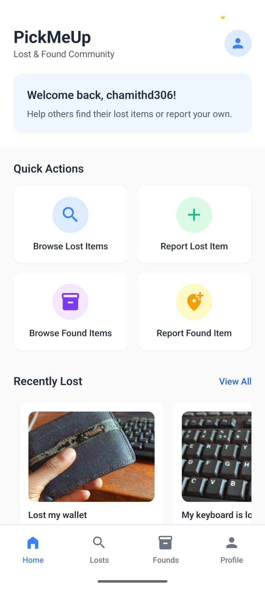

# PickMeUp - Lost & Found App 📱

[](LICENSE)
[](https://reactnative.dev/)
[](https://expo.dev/)

PickMeUp is a **mobile application** that helps users **report, track, and find lost or found items** in their local area. It uses **location-based matching**, **Firebase Authentication**, and **Firestore** to provide a seamless lost & found experience.  

---

## Table of Contents 📖

- [Features](#features-✨)  
- [Screenshots](#screenshots-📷)  
- [Demo GIF](#demo-gif-🎬)  
- [Installation & Setup](#installation--setup-⚙️)  
- [Usage](#usage-🛠️)  
- [Tech Stack](#tech-stack-🧰)  
- [Project Structure](#project-structure-📂)  
- [Contributing](#contributing-🤝)  
- [Resources](#resources-📚)  
- [License](#license-📝)  
- [Community & Support](#community--support-💬)  

---

## Features ✨

- **Report Lost & Found Items** – Upload photos, descriptions, and locations.  
- **User Profiles** – Track your lost and found items.  
- **Photo Uploads** – Multiple images stored securely in Firebase.  
- **Clean UI & Navigation** – Smooth navigation with Expo Router.  

---

## Screenshots 📷

*(Replace with actual screenshots from your app)*  

| Home Screen | Add Item | Item Details |
|------------|----------|--------------|
|  |  |  |

---

## Installation & Setup ⚙️

### Prerequisites
- Node.js v16+  
- npm or yarn  
- Expo CLI (`npm install -g expo-cli`)  

### Steps

```bash
# Clone the repository
git clone https://github.com/yourusername/pickmeup-app.git
cd pickmeup-app

# Install dependencies
npm install

# Start the Expo server
npx expo start
